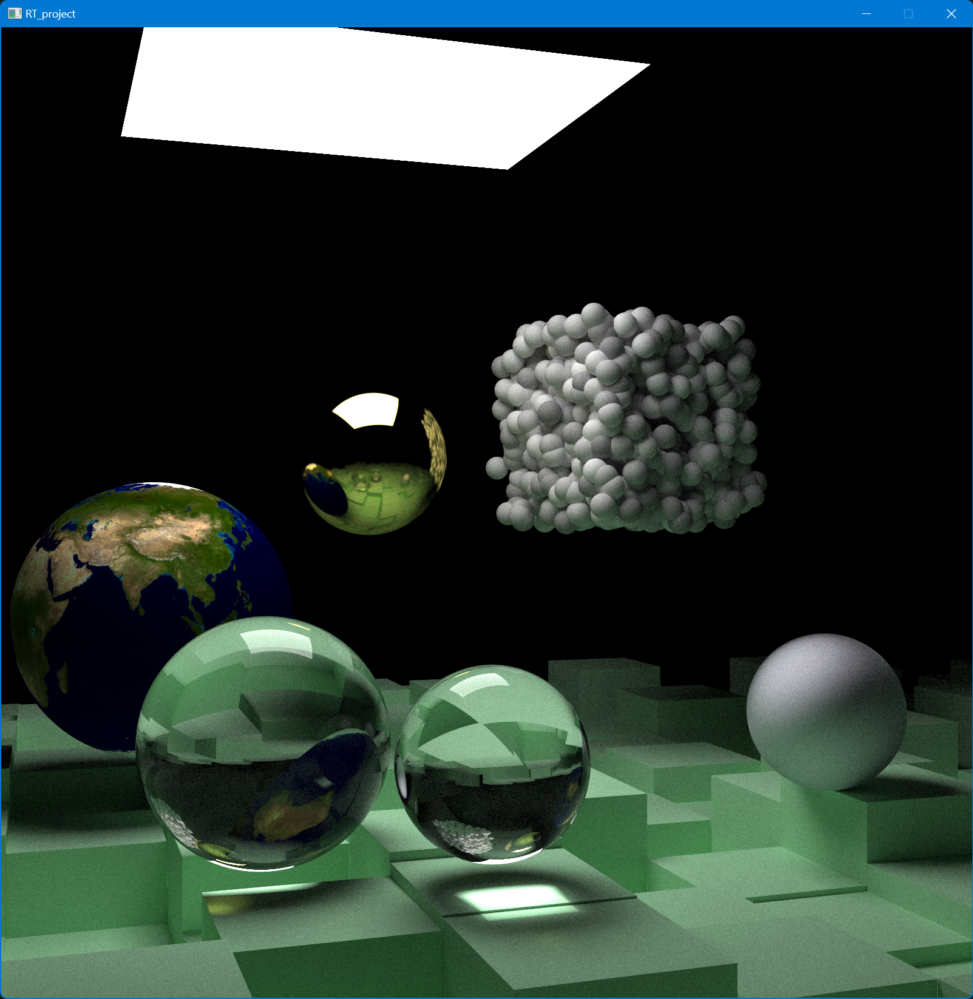

# RT_project

A primitive ray-tracer written in CUDA.

## Current status

- Forked from [Ray Tracing: The Next Week](https://raytracing.github.io/books/RayTracingTheNextWeek.html) 
with minimal modifications to provide a baseline.
- Working CUDA implementation with loop-based function calls

Reference render: 1600x1600 px, 1024 samples per pixel, depth of ray is 8.


### Frame time

Controlled test scene (same as the reference render above), 512x512 px, 32 samples per pixel, depth of ray is 4.
Camera spins at 0.1rad/frame for a total of 62 frames.

- AMD Ryzen 9 7940HS 8c16t: \~645 ms.
- NVIDIA GeForce RTX 4060 Laptop GPU: \~47.4 ms.

## How-to

### Debug
```shell
compute-sanitizer.bat .\RT_project.exe
```

### Build
Besides compiler toolchain, this project uses `CMake` and `vcpkg`.
Make sure to have `CMake` available on your system.

Initialize `vcpkg`:
```shell
git clone --recursive uri://link.to.this/repository.git
cd vcpkg
.\bootstrap-vcpkg.bat -disableMetrics
```

Initialize `CMake` configs and build. 
If you use MSVC, you need to run those commands inside the `Developer Command Prompt`:
```shell
cmake --preset=release
cmake --build ./cmake-build-release --target RT_project -j 4
```

The built program is found at `./cmake-build-release/RT_project.exe`

The core code for ray tracing can be found at `camera::render_pixel_block<>()` in `camera.cuh`.

### Run

Run with default arguments for real-time display output:
```shell
RT_project.exe
```

Run with arguments for real-time display output:
```shell
RT_project.exe --size <int> --depth <int> --samples <int> --frame <int>
```